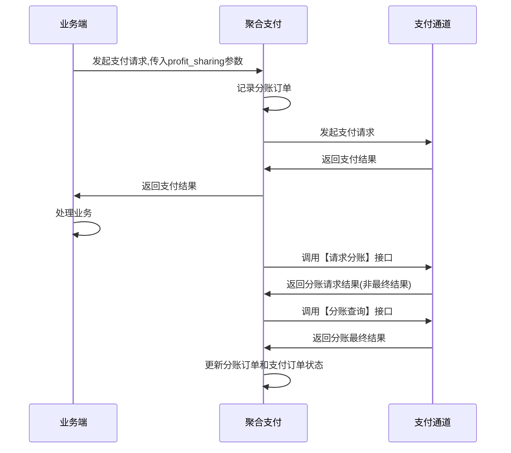
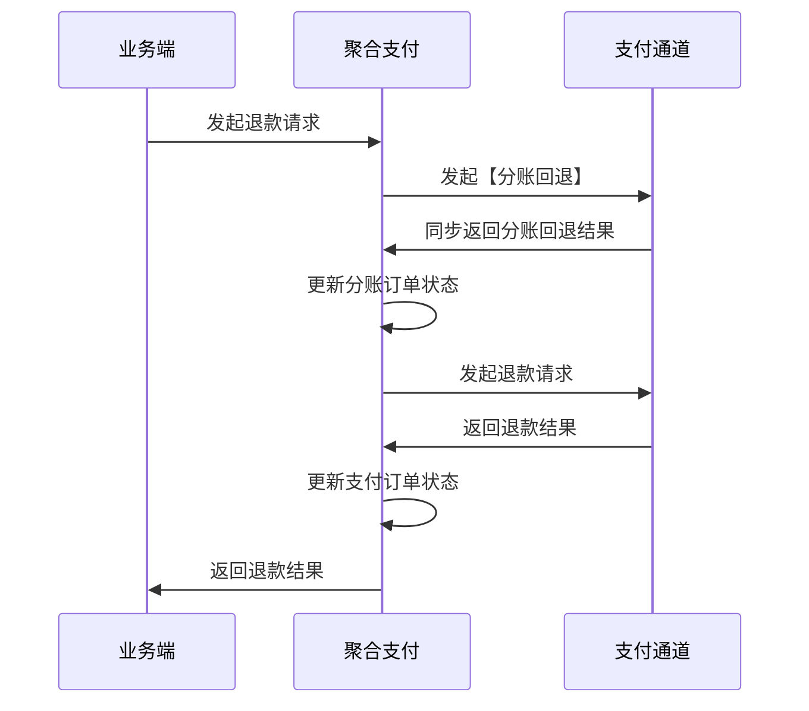

[toc]

# 分账产品PRD v1.1

## 文档综述
### 版本记录

| **版本号** | 修订时间   | 修订内容   |
| ---------- | ---------- | ---------- |
| 1.0        | 2020-04-16 | 第一次提交 |

### 名词解释

| **名词**   | **概念**                                                     |
| ---------- | ------------------------------------------------------------ |
| 分账方     | 将部分交易资金分出的一方,乐刷或微信子商户                    |
| 分账接收方 | 接收资金的一方,乐刷商户号或微信子商户/微信号/openid          |
| 发起分账   | 支付成功后进行资金分账                                       |
| 分账退回   | 支付订单进行退款时候,需要先进行分账退回,才可确保支付订单资金够退 |

### 参考文档

1. 服务商分账接口 https://pay.weixin.qq.com/wiki/doc/api/allocation_sl.php?chapter=24_1&index=1
2. 乐刷分账接口 https://www.yuque.com/leshuazf/doc/fz#KRHuf

## 产品概述

### 项目背景

1. 针对商场对商户的抽佣,代理商开发0费率客户想抽取一定手续费的场景,需要将顾客支付的费用在扣除手续费之后,分一部分到商场或者代理商的某个账户.
### 项目目标

1. 通过分账解决二清问题
2. 丰富支付在实际中运用场景

### 用户群体

| 角色                | 描述                 |
| ------------------- | -------------------- |
| 商场管理方          | 针对商家进行提点     |
| 代理商开发0费率客户 | 抽取千分之X手续费    |
| 商家联盟            | 针对商家交易进行提点 |

### 功能列表

| **功 能    模块 ** |   **功能点**   |                         **功能描述**                         |
| :----------------: | :------------: | :----------------------------------------------------------: |
|    **支撑系统**    | 分账接收方管理 |                 管理分账方和分账接收方的关系                 |
|                    |                |                                                              |
|    **支付系统**    |  请求单次分账  | 支付下单时候增加 profit_sharing 参数,支付成功后需要异步进行分账,分账成功则写入mps_order,做法参考押金预授权? |
|                    |    分账查询    |                             用于                             |
|                    |    分账回退    |        对应订单退款时,需先进行分账回退,再调用退款接口        |
|                    |  分账回退查询  |                     类似"退款查询"的概念                     |
|                    |  分账订单列表  |                     可查询分账订单,状态                      |
|    **会员系统**    | 移动支付对账单 |         需增加 分账金额列 汇总(正在改造合并报表呢?)          |
|                    |    清分报表    |       需增加 分账金额列以及汇总((正在改造合并报表呢?)        |
|   **钱客多APP**    |      对账      |        增加 分账金额 汇总,因为会影响客户对照实际收入         |

## 产品设计

### 通道对比

| 通道名称     | 乐刷                                                         | 子商户                                                       | 接口说明 |
| ------------ | ------------------------------------------------------------ | ------------------------------------------------------------ | -------- |
| 申请分账功能 | 【分账授权申请-电子合同版】https://www.yuque.com/leshuazf/doc/fz#3IzIg   【分账授权申请】https://www.yuque.com/leshuazf/doc/fz#SDuJJ | https://pay.weixin.qq.com/wiki/doc/api/allocation_sl.php?chapter=24_2&index=2 |          |
| 查询分账开通 | https://www.yuque.com/leshuazf/doc/fz#aw3NZ                  | 同意授权就是开通了                                           |          |
| 最大分账比例 | 最大30%                                                      | 最大30%                                                      |          |
| 添加分账方   | https://www.yuque.com/leshuazf/doc/fz#inAlJ                  | https://pay.weixin.qq.com/wiki/doc/api/allocation_sl.php?chapter=25_3&index=4 |          |
| 删除分账方   | 无此接口                                                     | https://pay.weixin.qq.com/wiki/doc/api/allocation_sl.php?chapter=25_4&index=5 |          |
| 请求单次分账 | https://www.yuque.com/leshuazf/doc/fz#xxq0D                  | https://pay.weixin.qq.com/wiki/doc/api/allocation_sl.php?chapter=25_1&index=1 |          |
| 请求多次分账 | https://www.yuque.com/leshuazf/doc/fz#1mWrX                  | https://pay.weixin.qq.com/wiki/doc/api/allocation_sl.php?chapter=25_6&index=2 |          |
| 分账查询     | https://www.yuque.com/leshuazf/doc/fz#PXHzA                  | https://pay.weixin.qq.com/wiki/doc/api/allocation_sl.php?chapter=25_2&index=3 |          |
| 分账回退     | https://www.yuque.com/leshuazf/doc/fz#upSk0                  | https://pay.weixin.qq.com/wiki/doc/api/allocation_sl.php?chapter=25_7&index=7 |          |
| 分账回退查询 | https://www.yuque.com/leshuazf/doc/fz#fhJH2                  | https://pay.weixin.qq.com/wiki/doc/api/allocation_sl.php?chapter=25_8&index=8 |          |
| 分账动账通知 | 分账或分账回退成功后,异步通知 https://pay.weixin.qq.com/wiki/doc/api/allocation_sl.php?chapter=25_9&index=9 | 无此接口                                                     |          |
| 支持支付方式 | 付款码支付（普通，人脸转付款码）、JSAPI支付、APP支付、小程序支付 | 所有支付类型                                                 |          |

### 下单接口

#### 微信子商户

| 字段名             | 变量名         | 必填 | 类型       | 示例值 | 描述                                                   |
| :----------------- | :------------- | :--- | :--------- | :----- | :----------------------------------------------------- |
| 是否指定服务商分账 | profit_sharing | 否   | String(16) | Y      | Y-是，需要分账N-否，不分账字母要求大写，不传默认不分账 |

#### 乐刷

| **字段名**   | **变量名** | **必填** | **长度限制** | **类型** | **说明**                                                     |
| ------------ | ---------- | -------- | ------------ | -------- | ------------------------------------------------------------ |
| 交易分账标识 | royalty    | 否       | 1            | string   | 预授权：2需分账：1不分账：0注：如果未传该字段默认按不分账处理 |

**注意事项：调用单次分账接口传1，调用多次分账接口传2**

## 时序图

### 支付流程

### 退单流程

## 信息结构

### 分账方管理

| 通道   | 分账方商户号 | 分账接收方账号 | 类型               | 接收方代理商 | 接收方归属商家 |
| ------ | ------------ | -------------- | ------------------ | ------------ | -------------- |
| 乐刷   | 800002222    | 800030099      |                    | 1card1       |                |
| 子商户 | 153669854    | 163997744      | 商户/微信号/openid |              | xyf            |

### 分账订单列表

| 分账订单号    | 支付订单号    | 第三方交易单号     | 分账详情 | 订单状态 |      |
| ------------- | ------------- | ------------------ | -------- | -------- | ---- |
| 2020041600001 | 2020041600563 | 420000054545455451 | {}       | 等待处理 |      |

####  分账详情

| 分账订单号    | 类型        |           | 金额(分) | 描述   |      |
| ------------- | ----------- | --------- | -------- | ------ | ---- |
| 2020041600001 | MERCHANT_ID | 163997744 | 200      | 服务费 |      |
